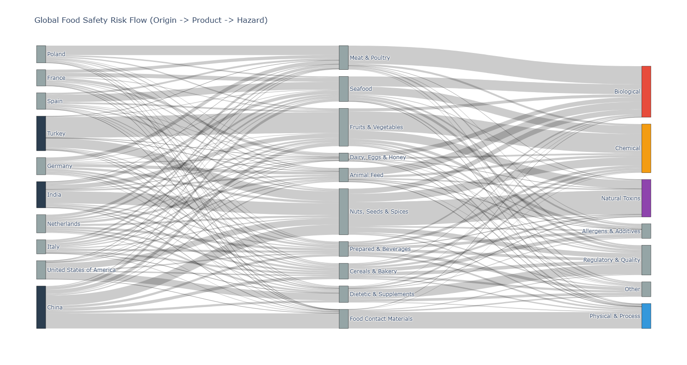
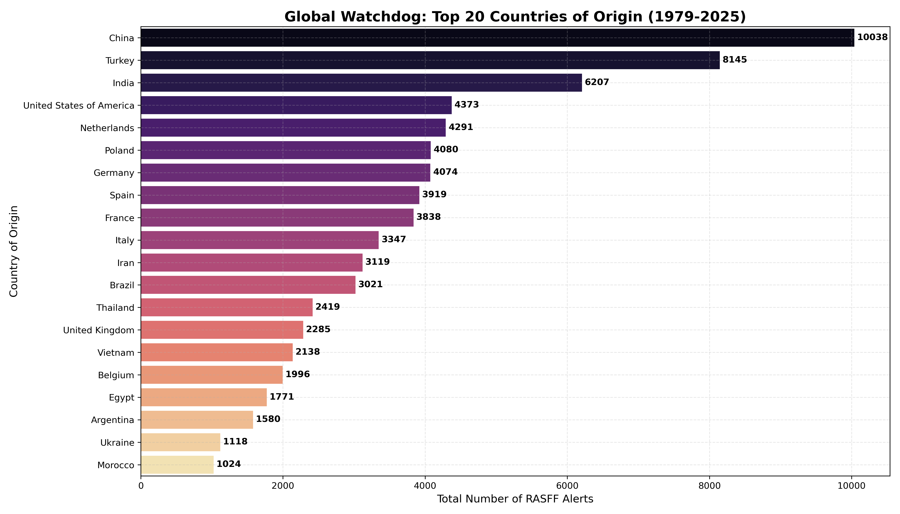
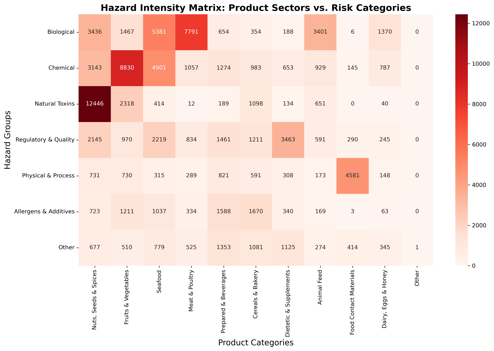
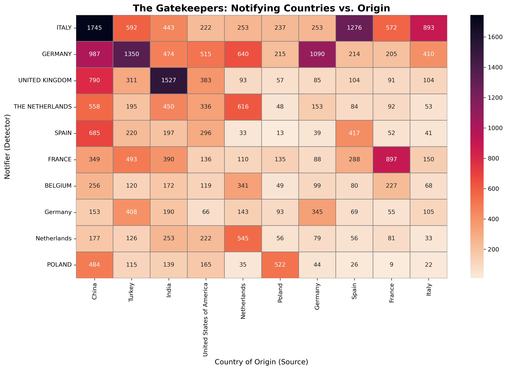

# 🛡️ The Global Food Safety Radar: 46 Years of EU Alerts (1979-2025)

## 📊 Project Overview
The **Rapid Alert System for Food and Feed (RASFF)** is the European Union's key tool to ensure food safety. This project analyzes a massive dataset of **100,390** alert notifications spanning 46 years to uncover global trade risks, contamination trends, and the political economy of food safety inspections.

### 🗝️ Key Findings at a Glance
* **Total Alerts:** 100,390 processed records.
* **Top Offender:** **China** (10,038 alerts) followed by **Turkey** and **India**.
* **Most Dangerous Combo:** **Nuts/Seeds** contaminated with **Mycotoxins** (Natural Toxins).
* **The Shift:** A distinct historical shift from Biological hazards (Salmonella) to Chemical hazards (Pesticides) and Regulatory issues.

---

## 1. The Big Picture: Global Risk Flow
*How do contaminants travel from global farms to European borders?*

*(Note: For better exprience see HTML file.)*

This flow diagram illustrates the complexity of the supply chain. We can clearly see the dominance of **Nuts, Seeds & Spices** as a high-risk category, flowing primarily from Asia and the Middle East.

---

## 2. Geography of Risk: Who is sending unsafe food?

After cleaning geospatial data (harmonizing "China/Hong Kong" and fixing encoding errors like "Türkiye"), **China** emerges as the undisputed leader in alerts, accounting for over 10% of the entire database. **Turkey** and **India** follow, driven largely by issues with produce and spices. Surprisingly, the **United States** ranks 4th, surpassing many developing nations.

---

## 3. The "Toxic Matrix": Product vs. Hazard
*What exactly is wrong with the food?*

This heatmap reveals the specific correlations between food types and dangers:
* **The Red Zone:** The intersection of **Nuts & Seeds** and **Natural Toxins** (Aflatoxins) is the single largest cluster of alerts (12,446).
* **The Chemical Belt:** **Fruits & Vegetables** are heavily impacted by **Chemical** hazards (Pesticide residues).
* **The Biological Zone:** **Meat & Poultry** remain the primary vector for **Biological** pathogens like Salmonella and Listeria.

---

## 4. The "Gatekeepers": Who is policing the borders?
*Food safety data often reflects inspection intensity rather than just food quality.*

This analysis uncovers specific trade-route targeting:
* **Italy vs. Turkey:** Italy triggers a massive number of alerts specifically for Turkish imports (likely Nuts/Fruits).
* **UK vs. India:** The UK (pre-Brexit) was the primary detector of issues originating from India.
* **Germany:** Acts as a general "Omni-detector," showing high alert volumes across almost all trading partners.

---

## 5. Timeline: The Evolution of Risk (2000-2025)

_new.png)

* **The Mycotoxin Spike:** Note the green line surging in the early 2000s.
* **The 2021 Surge:** The pink line ("Other") spikes dramatically in 2020-2021, correlating with the massive **Ethylene Oxide** crisis that affected thousands of products.

---

## 🛠️ Methodology & Data Cleaning

**Data Source:** RASFF Portal (1979-2025).
**Total Records:** N=100,390.

To ensure statistical accuracy, the following harmonization protocols were applied:
1.  **Temporal Normalization:** A data gap in the 2015–2016 period caused by inconsistent date formatting was rectified using Reference ID extraction, recovering ~5,800 lost records.
2.  **Geospatial Harmonization:** Country of Origin labels were standardized to ISO-3 conventions (e.g., merging "China" with "Hong Kong", and correcting encoding errors for "Türkiye").
3.  **NLP & Categorization:** 29 granular hazard categories were aggregated into 7 HACCP-aligned macro-groups using Natural Language Processing (NLP) mapping to facilitate high-level trend analysis.

---

## 🚀 Technologies Used
* **Python:** Pandas, NumPy
* **Visualization:** Matplotlib, Seaborn, Plotly (Sankey)
* **Data Cleaning:** Regex, String Matching

---
*Author: MD SHAFIN AHAMED*
